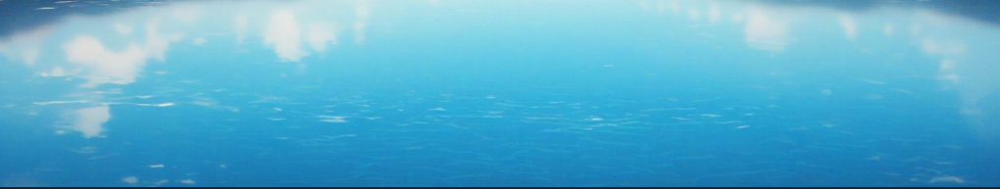
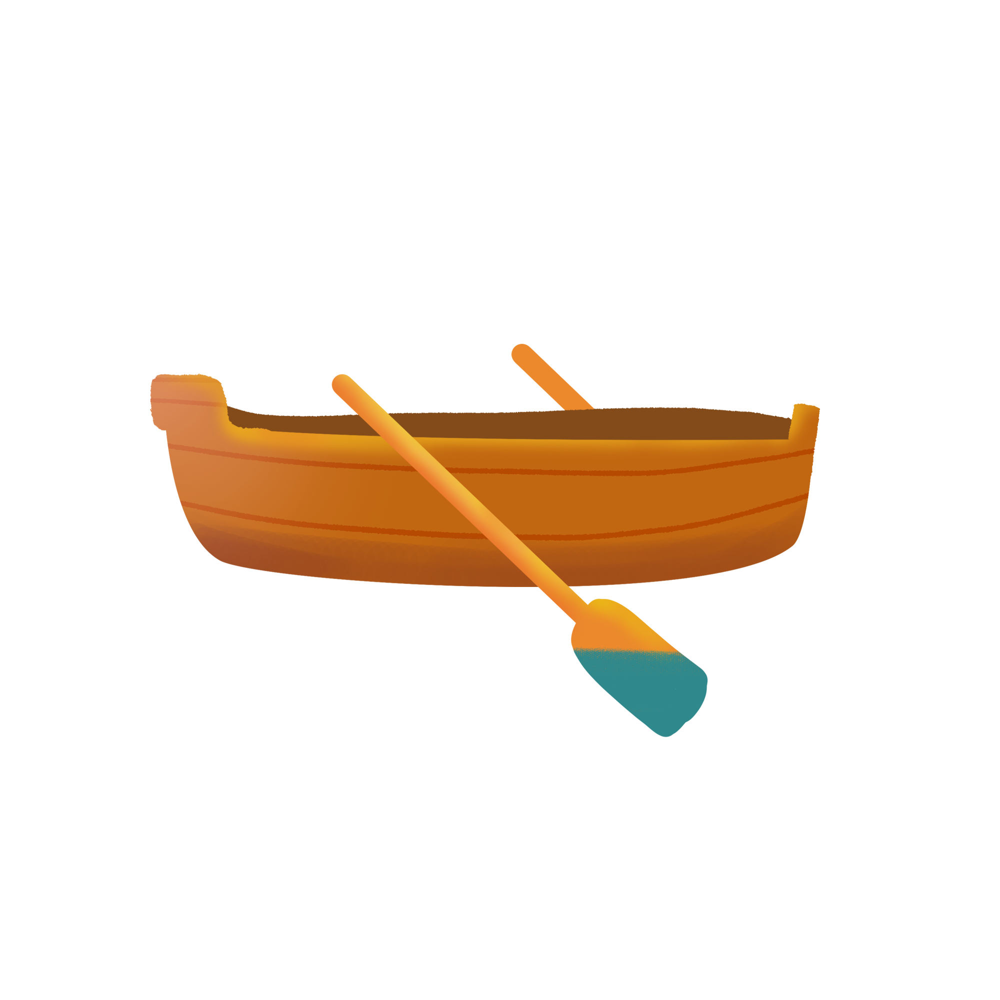
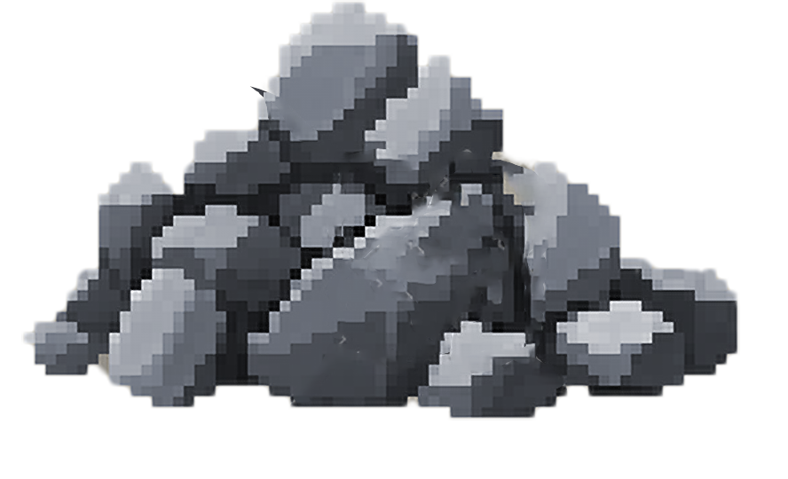
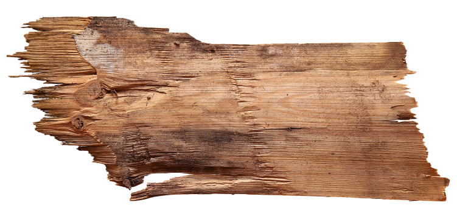
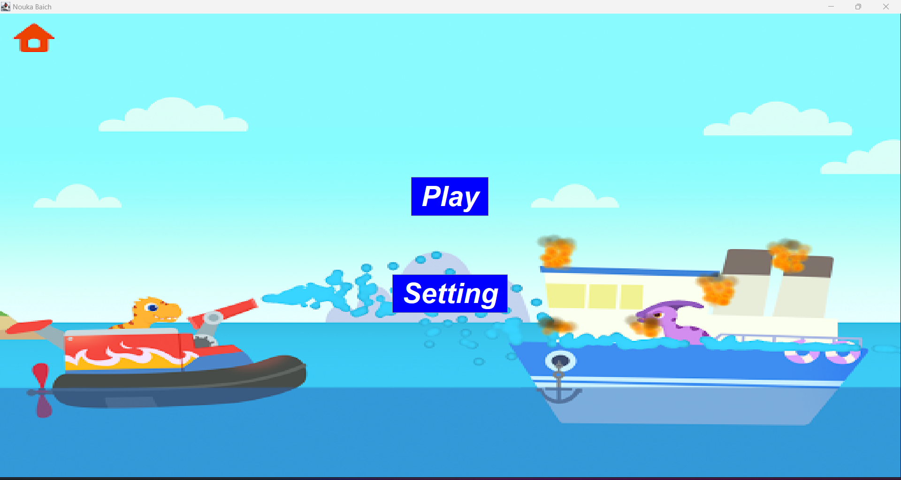
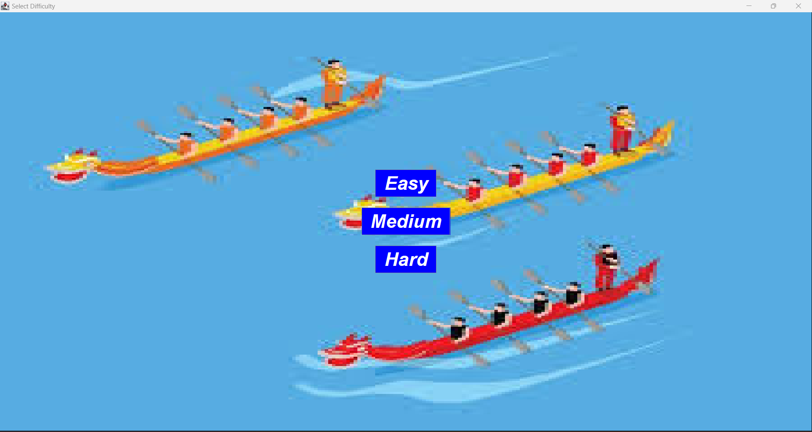

<b><u>Game Property</u></b>

 

 > ### GUI based Java Project Using Java Swing

  

<table border=10 bgcolor="pink" width= 500 height=300>
    <thead>  Major Idea listed in short:- </thead>
    <tbody>
        <tr>
              <td colspan="3"> 
<b><u>NoukaBaich</u></b>
</td>
        </tr>
        <tr>
                <td rowspan="5"> <b><u>Game</u></b></td>
                <td><b><u>
Level</u></b>
</td>
                <td><b><u>
Scores</u></b>
</td>
        </tr>
        <tr>
                <td><b><u>
Easy</u></b>
</td>
                <td rowspan="2"><b><u>
Low Score=0 High score Best Score 
                <Best Score></u></b>
</td>
        </tr>
             <td><b><u>
Medium</u></b>
</td>
        <tr>
        </tr>
             <td><b><u>
Hard</u></b>
</td>
        <tr>
        </tr>
   </tbody>
</table>
 
 

>## The Following pictuere is the Background of this game.
*  ***A River  flowing towarsd left side***  
*  ***Multiple obstale coming from right side.(let's see the next picture of obstacle in this game.)***

 
 
   

>## ***BOAT***  

 * ***It's been developed in Adobe Photoshop.***
 * ***A Small boat with a handle***

> ## Obstacles

***Main obstacle in this game. These come from right direction of the window with a minimum speed and becomes faster with the time.***  
* major obstacle names  

    * ***Stone***
    * ***Log***

  
 
 
 

> ## First Window Background  
* ***Two small boats and two Cartoon obejcts are chasing each other with water gun***

 
 
 
> ## First Window appears with Only Two Options
* ***Play***   

      * Easy  
      * Medium  
      * Hard

* ***Setting***
  

  
 
  

> ## Second Window   
* ***It basically comes with the pre-mentioned three options.***

