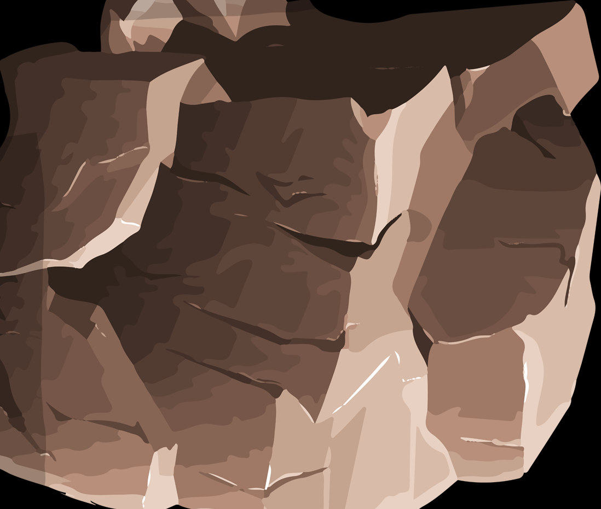

 <h1 style="color:lime"><u><b> Game Property</b></u></h1>

 

 > ### 
<i>GUI based Java Project Using Java Swing</i>

 

<table border=10 bgcolor="#17202a" width= 600 height=200>
    <thead> <b><i> Major Idea listed in short:- </i></b></thead>
    <tbody>
        <tr>
              <td colspan="4"> 
<b><u>NoukaBaich</u></b>
</td>
        </tr>
        <tr>
                <td rowspan="5"> <b><u>Game</u></b></td>
                <td><b><u>
Level</u></b>
</td>
                <td><b><u>
Scores</u></b>
</td>
                <td><b><u>
Created By</u></b>
</td>
        </tr>
        <tr>
                <td><b><u>
Easy</u></b>
</td>
                <td rowspan="4"><b><u>
Low Score=0 High score Best Score 
                <Best Score></u></b>
</td>
                <td rowspan="4"><b><u>
Md.Ahad Siddiki Most. Busrana Alme Md.Kobir Hossain 
                <Best Score></u></b>
</td>
        </tr>
             <td><b><u>
Medium</u></b>
</td>
        <tr>
        </tr>
             <td><b><u>
Hard</u></b>
</td>
        <tr>
        </tr>
   </tbody>
</table>

 
 

 
<h2><u><i>Background</i></u></h2>
 

*  ***
A River  flowing towards left side*** 
 
*  ***
Multiple obstale coming from right side.(let's see the next picture of obstacle in this game.)*** 

 
 
   

  
 

<h2><u><i>Boat</i></u><h2>

*  ***
A river boat,Fantastic looking*** 
 
* ***
It's been developed in Adobe Photoshop.***

 
 
   

> ## ***
First Window appears with Only Four Options
***
* ***
Start***
   

      * Easy 
      * Medium  
      * Hard  
* ***
Instructions
***
* ***
Credit
***
* ***
EXIT
***

  
 
  

<u><i><h2>Difficulty Level</h2><</i></u>

* ***
Easy
*** 

     * 
It starts with very small speed.
  
* ***
Medium
*** 

     *  ***
It starts with very average speed.
***  
* ***
Hard
*** 

     * ***
It starts with very high speed.
***

 
 
   

 ***
<u><h2><i>Instructions</i></h2></u>
***

* 
 Use upward arrow sign to move the boat perpendicularly upward.
  
* 
 Use downward arrow sign to move the boat perpendicularly downward.

* 
 Press ESC kew to exit the game.

 
 
     

 ***
Sailing Boat and Obstacles
***

***
Main obstacle in this game. These come from right direction of the window with a minimum speed and becomes faster with the time.***
 
* ***
major obstacle names:-***

    *  ***
Stone***

    

 
 
     

 ***
Obstacles
***

  
 
 
 

  

 ***
Game Over 
*** 

* ***
It offers two options:-***

     * ***
Play again***
  
     *  ***
Go back to Main menu***

 
 
   

<u><i><h2> Created By

* ***There is an option to go back to previous window.***  

* ***
Md.Ahad Siddiki***
  
* ***
Most.Busrana Alme***
  
* ***
Md.Kobir Hossain***

 
 
   

## ***
Contact Us:***

***
facebook link***

>[Ahad Siddiki](https://www.facebook.com/ahad.siddike)  
[Busrana Alme](https://www.facebook.com/search/top?q=busrana%20alme)  
[Md Kabir Hossain](https://www.facebook.com/Kabir.Hossain2429/)

